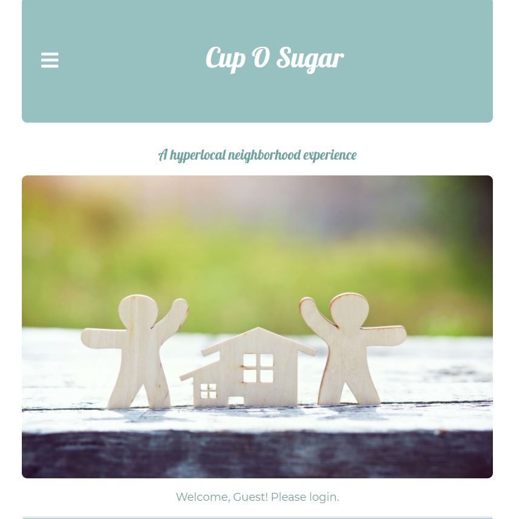
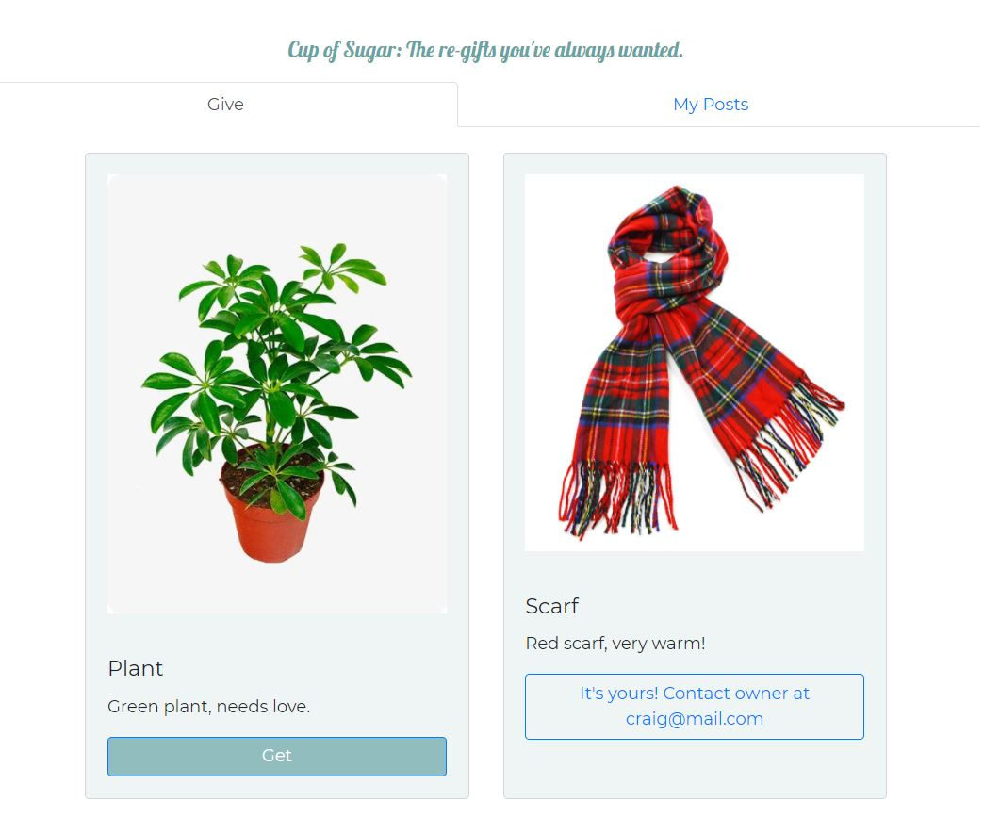

# Neighborhood Cup-O-Sugar

## Table of Contents
* [Description](#description)
* [Links](#links)
* [Technologies](#technologies)
* [Usage](#usage)
* [Future-Direction](#future-direction)
* [Credits/Collaborations/Questions](#Credits/Collaborations/Questions)
* [License](#license)

## Description
​Cup Of Sugar is a hyperlocal neighborhood experience that allows users to promote a friendly environment and share free items within their community. Our application allows the user to browse through a list of free items posted by their neighbors & get the items they like as long as those items are available. The users can also create their own posts of free items within their neighborhood.

## Links
* [Deployed Link](https://hyperlocal-cup-of-sugar.herokuapp.com/)

## Technologies
* Node / Express
* Mongoose Database Atlas
* Passport / Bcrypt / Fastest Validator
* Multer
* Cloudinary / Cloudinary-React
* React / React-Bootstrap
* Heroku
​
## Usage
​Users can register for an account with their name, email and password. Currently the app supports the Seattle area only. Once registered or once the user logs in, they will see a list of what neighbors have posted to give away. If a user wants an item they can click the "Get" button and will be shown the post owners' email to contact for pick up. The user can click on the top right + to create a post with a item name, description and photo. Users can see all the posts they have created in the My Posts tab and can delete if a post if they have changed their mind about giving away the item. 

## Screenshots
Home Page:  

List of Gives:  

## Future-Direction
Some future add-ons that would enhance our application include:
* Chat or message between users
* Ability for user to repost item 
* Post a location for pickup using map pin

## Credits/Collaborations/Questions:
Sally Perez:
[GitHub](https://github.com/SeattleSal)
email:sally.perez@gmail.com

Bryan Moreno:
[GitHub](https://github.com/bfourGitHub)
email:bfourbryan@gmail.com
​
## License
Copyright (c) [2021] [Sally Perez, Bryan Moreno]

Permission is hereby granted, free of charge, to any person obtaining a copy of this software and associated documentation files (the "Software"), to deal in the Software without restriction, including without limitation the rights to use, copy, modify, merge, publish, distribute, sublicense, and/or sell copies of the Software, and to permit persons to whom the Software is furnished to do so, subject to the following conditions:

The above copyright notice and this permission notice shall be included in all copies or substantial portions of the Software.

THE SOFTWARE IS PROVIDED "AS IS", WITHOUT WARRANTY OF ANY KIND, EXPRESS OR IMPLIED, INCLUDING BUT NOT LIMITED TO THE WARRANTIES OF MERCHANTABILITY, FITNESS FOR A PARTICULAR PURPOSE AND NONINFRINGEMENT. IN NO EVENT SHALL THE AUTHORS OR COPYRIGHT HOLDERS BE LIABLE FOR ANY CLAIM, DAMAGES OR OTHER LIABILITY, WHETHER IN AN ACTION OF CONTRACT, TORT OR OTHERWISE, ARISING FROM, OUT OF OR IN CONNECTION WITH THE SOFTWARE OR THE USE OR OTHER DEALINGS IN THE SOFTWARE.
